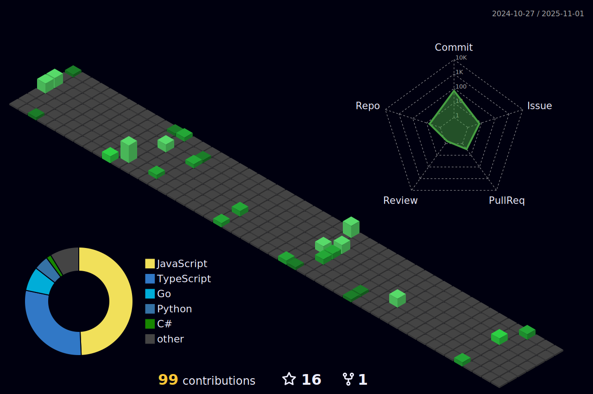

👋 Olá, eu sou @guicastro13, de Rio claro - SP - Brasil.
 
 
  Programação é um universo fantastico.
  Gosto de ter conhecimentos gerais sobre a area(hardware ao sorftware), acho relevante para trazer soluções mais robustas
  

 
 
 
 
 
 
 
 

### ⚙️ Algumas tecnologias e ferramentas que utilizo

<code></code>
<code></code>
  <code></code>
<code></code>
<code></code>
<code></code>
<code></code>

### 🚀 Outras estastísticas

  
  
  

<!---
guicastro13/guicastro13 is a ✨ special ✨ repository because its `README.md` (this file) appears on your GitHub profile.
You can click the Preview link to take a look at your changes.
--->
